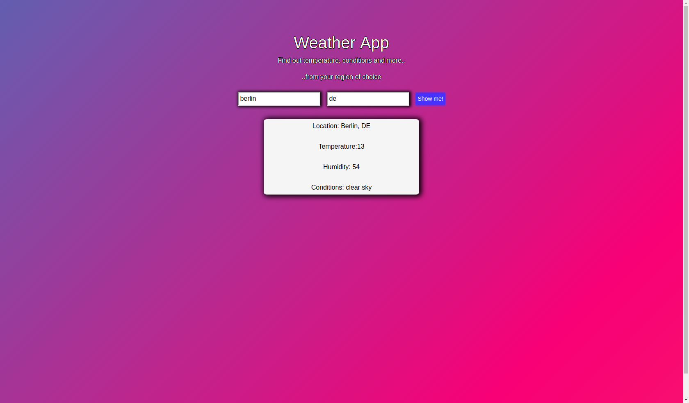

## React-Weather

Getting and displaying Data from a ***Weather-API*** with [React.js](https://reactjs.org/) :construction_worker: :construction_worker:

<p align="center"> 

</p>

## Please feel free to try this :poop: out [live](https://sun.web-developer-js.de) 

Type for example ***Berlin*** in the searchfield and the two-letter code for that country i.e. ***DE*** and click ***show me*** then after a short while some data should appear below the input area!

## Project Info

Use the ***create-react-app*** feature where ***webpack*** runs in the background as a ***Task-Manager***. 

## Local Version

If you have cloned the repository please run:
```
yarn
```
to install dependencies and 

```
npm start
```
to start the application in your browser.
